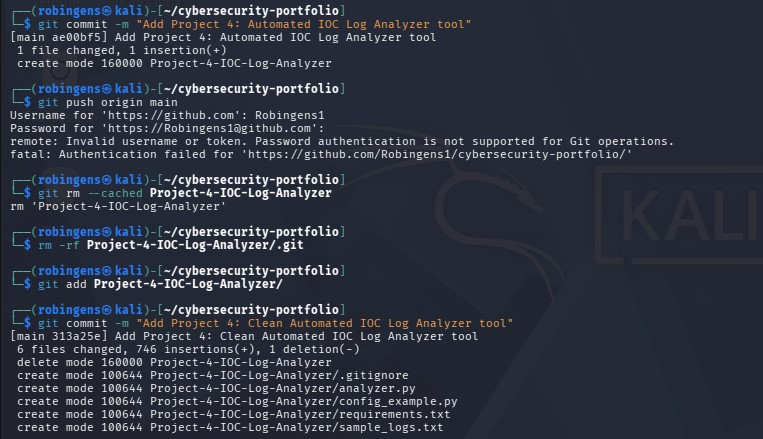
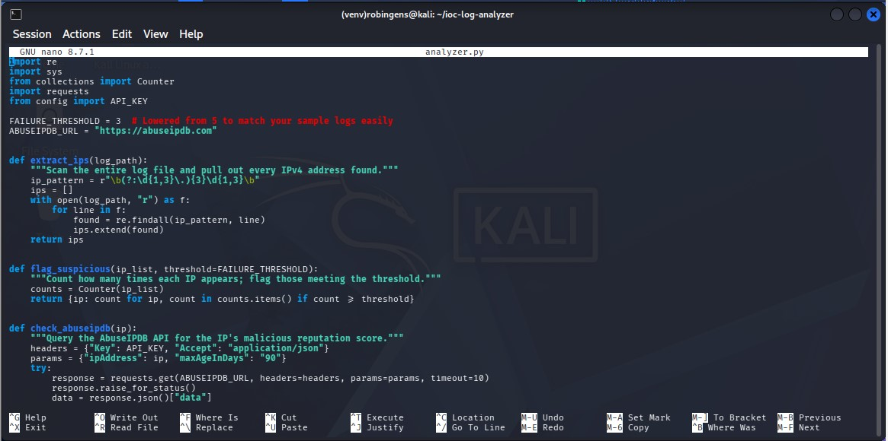
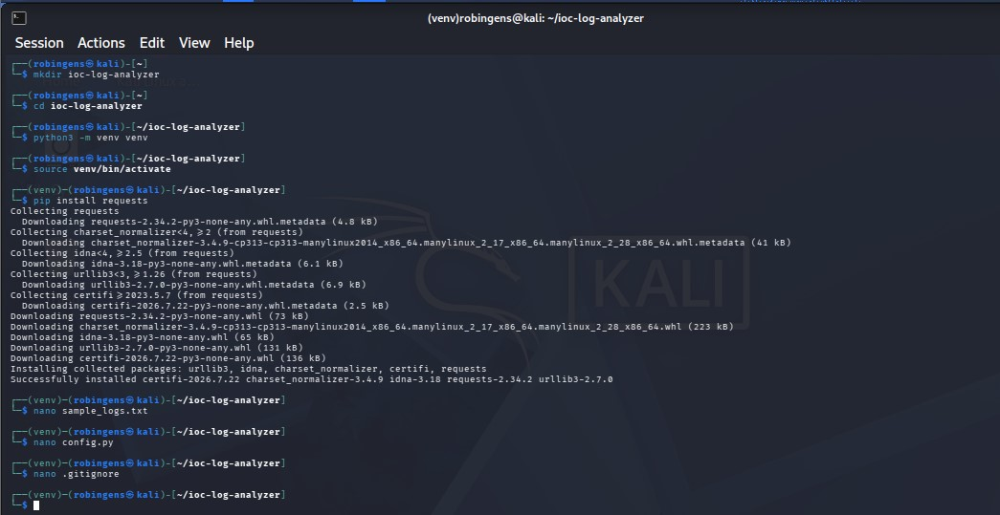
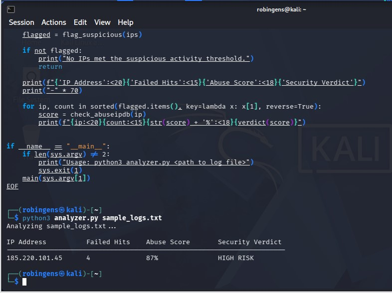
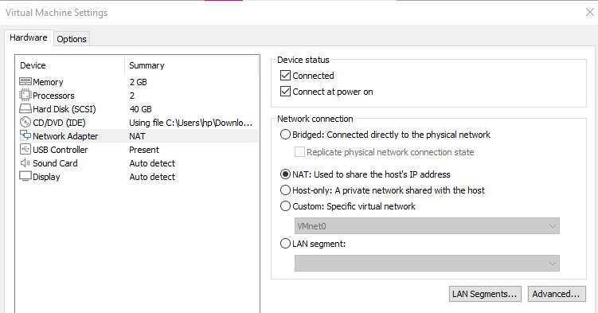
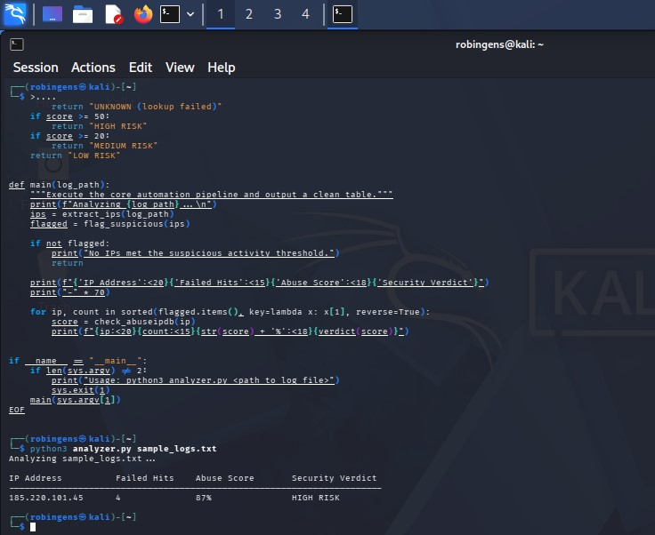
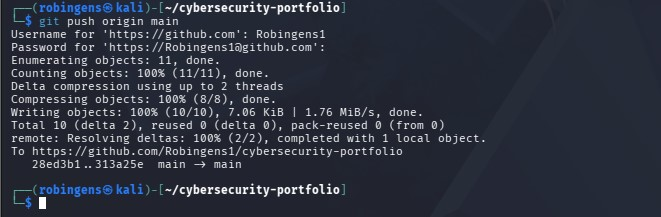

## 📸 Step-by-Step Engineering Timeline

### 1. Environment & Virtual Workspace Setup
Proven initialization of an isolated, dedicated workspace environment inside Kali Linux utilizing localized dependencies.

### 2. Code Implementation & Automation Core
The complete script core architecture integrating log parsing logic with targeted telemetry arrays.

### 3. Data Leak Prevention & Privacy Guards
Configuring `.gitignore` protocols to shield sensitive API authentication tokens from public repositories.

### 4. Resilient Engineering & Exception Handling
Testing programmatic safety loops. The script captures unexpected network drops gracefully without crashing.

### 5. Virtual Network & Lab Diagnostics
Reconfiguring infrastructure adapters to map paths from the virtual machine environment to outward gateways.

### 6. Successful Live Threat Triage Production Output
The final operational result table cleanly listing target malicious IPs, login attempts, and dynamic threat intelligence classifications.

### 7. Secure Repository Publishing & Token Authentication
Deploying final code structures live to a cloud repository using encrypted Personal Access Tokens (PAT).

